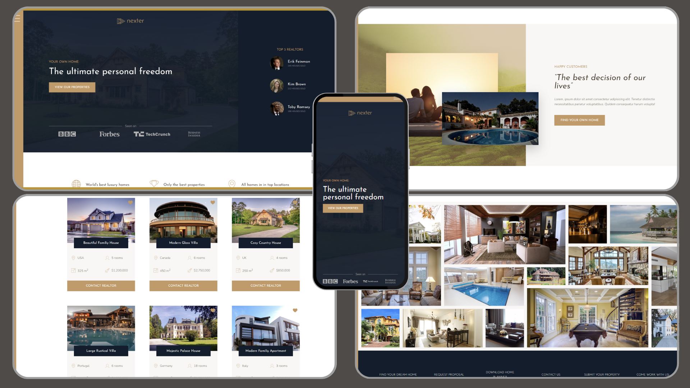

# Nexter | Your Home, Your Freedom



## Overview

Nexter is a web project that showcases luxurious homes from around the world. It provides users with detailed information about various properties, top realtors, and customer stories. This project demonstrates the use of advanced CSS and Sass for creating a visually appealing and responsive web design.

## Table of Contents

- [Overview](#overview)
- [Features](#features)
- [Tech Stack](#tech-stack)
- [File Structure](#file-structure)
- [Installation](#installation)
- [Usage](#usage)
- [Credits](#credits)
- [License](#license)

## Features

- **Responsive Design**: The website is fully responsive, providing a seamless experience across different devices.
- **Navigation Menu**: A stylish and interactive navigation menu.
- **Property Information**: Detailed information about various luxurious homes.
- **Top Realtors**: Information about top realtors and their achievements.
- **Customer Stories**: Stories from happy customers who have found their dream homes.
- **Gallery**: A beautiful gallery showcasing various properties.
- **CSS Grid and Flexbox**: Utilizes CSS Grid and Flexbox for layout management.

## Tech Stack

- **HTML**
- **CSS**
- **Sass**

## File Structure

```
/nexter
|-- /css
| |-- style.css
|
|-- /img
| |-- favicon.png
| |-- logo.png
| |-- logo-bbc.png
| |-- logo-forbes.png
| |-- logo-techcrunch.png
| |-- logo-bi.png
| |-- realtor-1.jpeg
| |-- realtor-2.jpeg
| |-- realtor-3.jpeg
| |-- sprite.svg
| |-- story-1.jpeg
| |-- story-2.jpeg
| |-- house-1.jpeg
| |-- house-2.jpeg
| |-- house-3.jpeg
| |-- house-4.jpeg
| |-- house-5.jpeg
| |-- house-6.jpeg
| |-- gal-1.jpeg
| |-- gal-2.jpeg
| |-- gal-3.jpeg
| |-- gal-4.jpeg
| |-- gal-5.jpeg
| |-- gal-6.jpeg
| |-- gal-7.jpeg
| |-- gal-8.jpeg
| |-- gal-9.jpeg
| |-- gal-10.jpeg
| |-- gal-11.jpeg
| |-- gal-12.jpeg
| |-- gal-13.jpeg
| |-- gal-14.jpeg
|
|-- /sass
| |-- abstracts
| |-- base
| |-- components
| |-- layout
| |-- pages
| |-- _home.scss
| |-- main.scss
|
|-- index.html
|-- package.json
```

## Installation

1. Clone the repository:

```
git clone https://github.com/kamrancodex/nexter.git
```

Navigate to the project directory:

```
cd nexter
```

Install the dependencies:

```
npm install
```

### Usage

Compile the Sass files to CSS:

```
npm run compile:sass
```

Open index.html in your browser to view the website.

### Credits

Kamran Bashir - Built the project using advanced CSS and Sass.
Jonas Schmedtmann - Original author and inspiration for the project design.
Built using advanced CSS and Sass. A credit to the original author, Jonas Schmedtmann, is highly appreciated!
